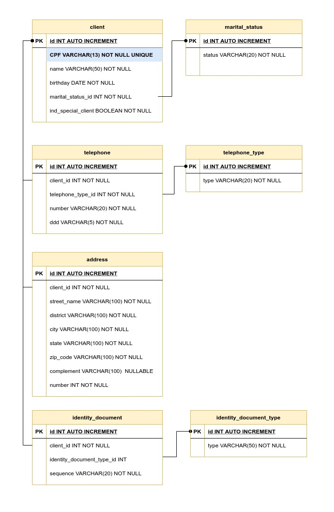

# MATERA ONBOARDING
## Sobre
Matera Onboarding é um projeto composto por APIs REST, `Client`, `Address`, `IdentityDocument` e `Telephone`. São organizados como mostra na imagem abaixo:

## Roadmap 

- Semana 1 - Montagem de ambiente e Codificação;
- Semana 2 - Revisão de Código e Correções;
- Semana 3 - Implementação de Testes Unitários e Revisão dos testes unitários;
- Semana 4 - Merges, Resolução de Conflitos e Fechamento de Versão

## Pré Requisitos

Para esse projeto, será necessário a instalação e configuração das sequintes ferramentas:
- Maven
- Git
- IDE (Eclipse de preferência por conta do suporte GSX / Intellij)

## Primeiros passos

1.Clonar o repositório para o ambiente local.

        git clone https://stash.matera.com/scm/mat/matera-onboarding.git

2.Dentro do diretório do projeto, realizar um build do projeto utilizando o Maven.

        mvn clean install

3.Importar o projeto para IDE (Eclipse / Intellij) 

4.Rodar a aplicação Springboot:

    Intellij:
   
        Rodar a classe matera-onboarding/rest-application/src/main/java/com/matera/onboarding/materaonboarding/MateraOnboardingApplication.java

    Eclipse:
   
        Rodar a classe matera-onboarding/rest-application/src/main/java/com/matera/onboarding/materaonboarding/MateraOnboardingApplication.java
        ou
        Installar o plugin Spring Tools e rodar com esse plugin

5.Nós usamos a [biblioteca Lombok](https://projectlombok.org/) neste projeto, então caso for abri-lo em uma IDE, como IntelliJ ou Eclipse, você deve instalar um plugin para conseguir rodar a aplicação sem erros.

6.Para validar o ambiente local, abra um navegador e faça a seguinte requisição:

        http://localhost:8080/api/v1/example/hello

### Banco da dados
Inicialmente o projeto será desenvolvido utilizando o H2 Database.

## Documentação
Você pode acessar a documentação do projeto em others/docs/DV_MateraOnboarding.odt